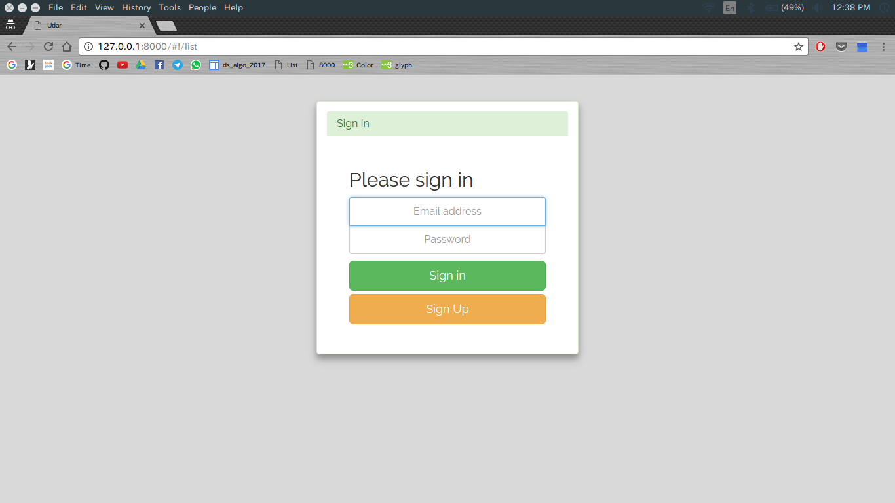
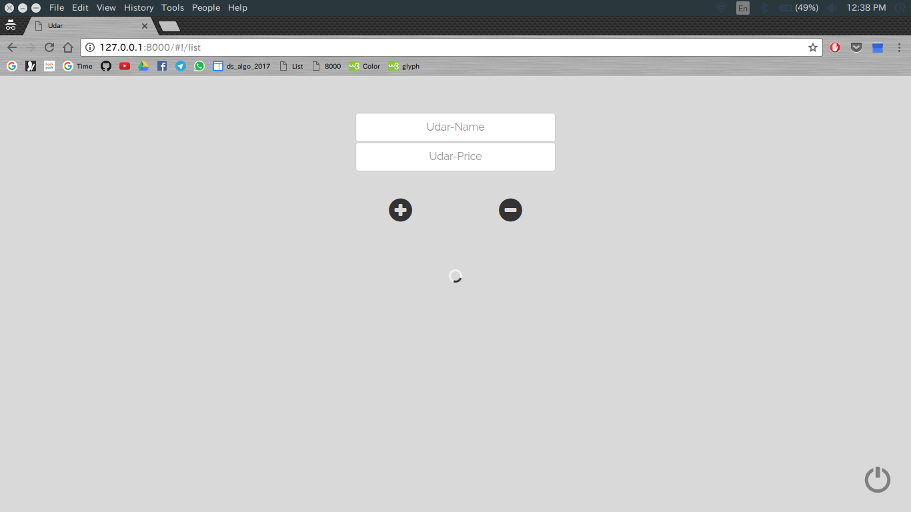
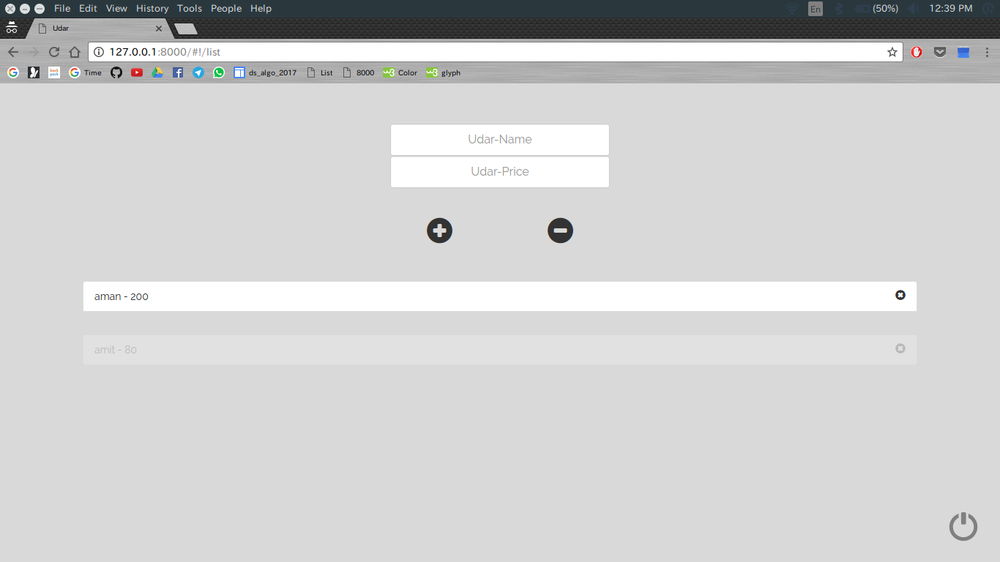
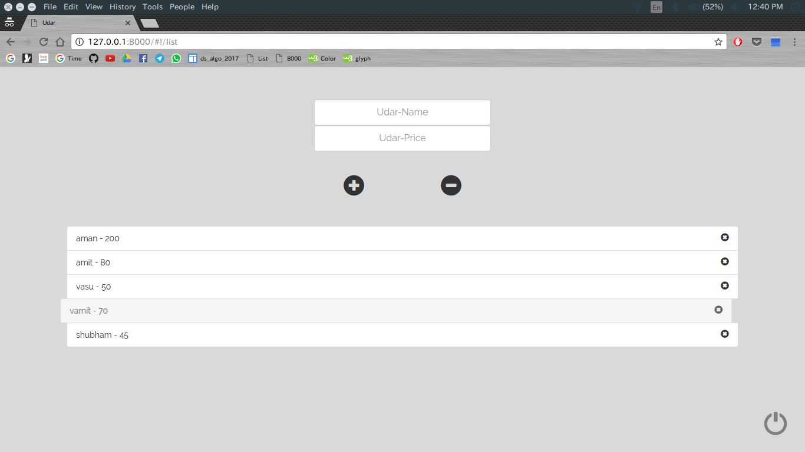
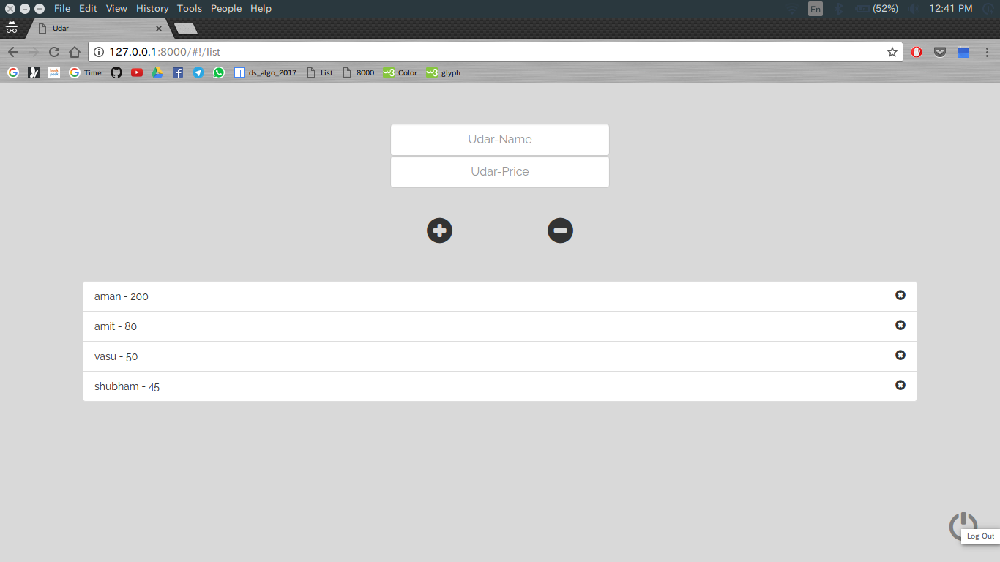

# Udar

  
 
Track your expenses and manage wallet funds...

# What is it?
Complete dynamic Firebase web Application. Uses angularJS and its MVC framework, and some basic DOM throughout the web application.
View At : https://mayankmtg.github.io/Udar/#!/list

## Aim
The main aim of the application is to:

- Develop an Application that uses firebase Database in the backend.
- Deepen the understanding of Angular MVC framework.
- Develop the expense tracking and money lended application for personal use :P.

## Screenshots

 

 

## Features
- Firebase Authentication of every user
- Firebase Realtime addition of items
- Firebase Realtime removal of items
- URL resolving, routing and redirection
- Support for addition of as many pages an required
- Angular Filters
- Angular Controllers
- Angular Animations and Transitions

## How to View
- Host the application on any server (Hosting is important because of angular)
- SimpleHTTPServer ot node http-server can work fine.
- That it!

## Technologies Used

- Firebase
- HTML
- CSS
- Javascript
- AngularJS
